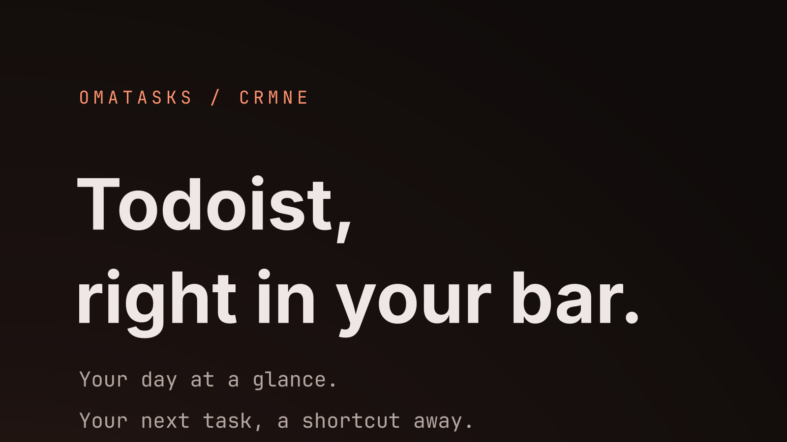
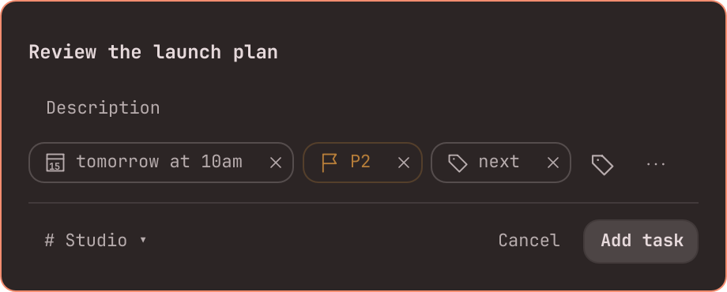
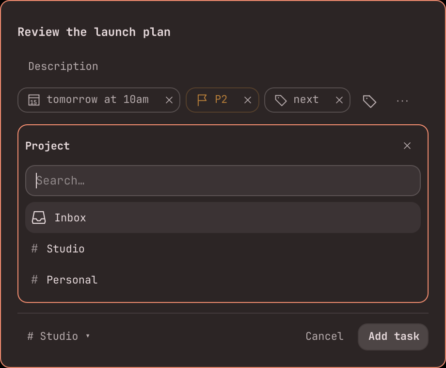
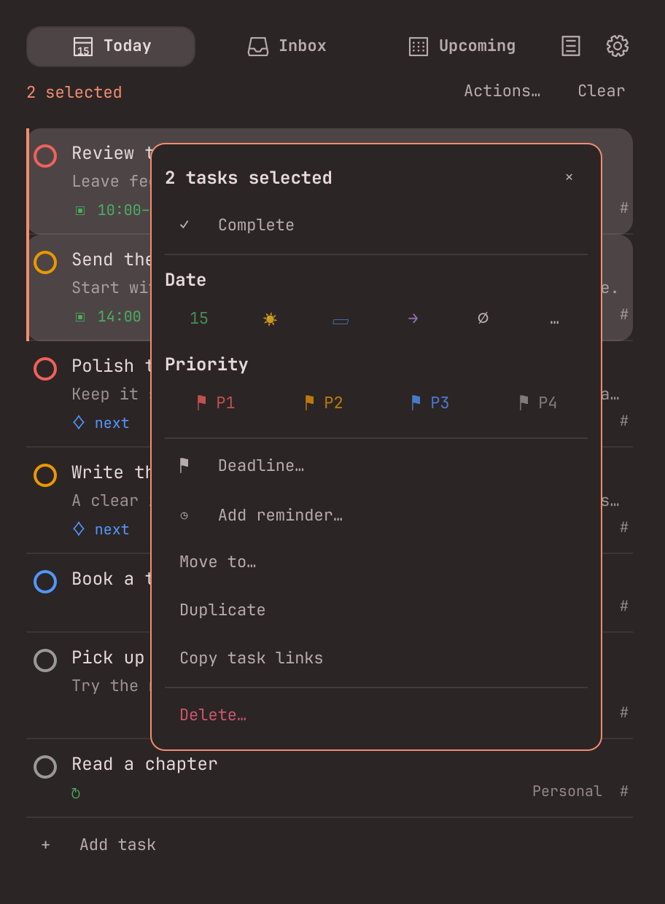
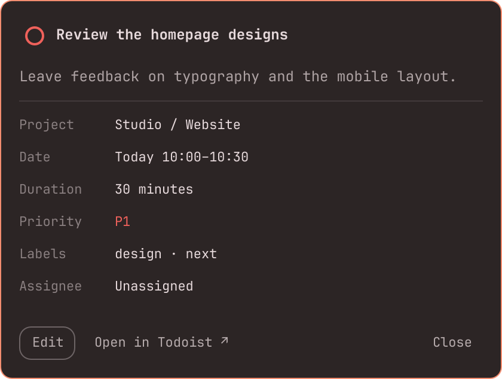
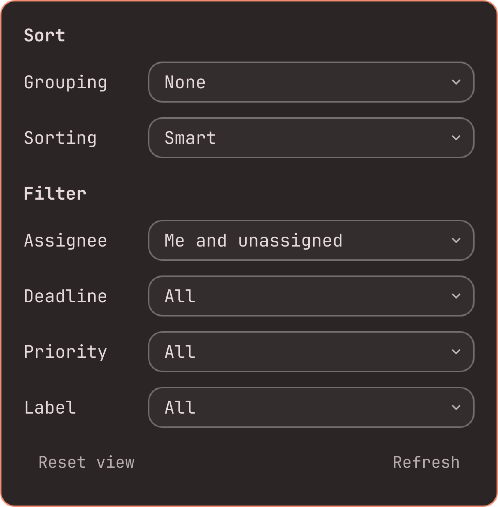

# OmaTasks for Todoist

Your Todoist day in the Omarchy bar, with a native Quick Add a shortcut away.



**Today · Inbox · Upcoming · Quick Add · Edit · Multi-select · Drag to reorder**

A compact list that puts your tasks first. Open the bar panel to plan your day,
complete a task, or change its details. Press **Alt+Space** to capture something
new with projects, labels, dates, priorities, and reminders.

Everything follows your Omarchy theme. Adjust the panel size, grouping, sorting,
and filters from inside the panel. Tasks sync directly with Todoist's API.

## Install

```sh
omarchy plugin add https://github.com/crmne/omatasks.git --enable
```

### Requirements

- Omarchy Quattro with its Quickshell shell and Hyprland.
- A Todoist account and its personal API token.

No extra packages or Todoist CLI are required. The runtime uses QML's HTTPS
client; Hyprland manages the shortcut, and standard shell utilities save your
local settings. Node.js is only used for development tests.

## Connect

Click the **Todoist icon** in the bar. Setup appears **inside that panel**:

1. Open Todoist → **Settings → Integrations → Developer**.
2. Copy your API token. The panel links directly to [Developer settings](https://app.todoist.com/app/settings/integrations/developer).
3. Paste the token into the password field and select **Connect**.

The token is validated before being saved. It lives in `$XDG_CONFIG_HOME/omarchy-todoist/token` (normally `~/.config/omarchy-todoist/token`) with mode `0600`, inside a `0700` directory. It is sent to the credential writer through stdin and to Todoist through an HTTPS authorization header. It is never stored in `shell.json`, command arguments, or this repository. Display preferences are stored in `views.json` beside it. Task data stays in memory.

Temporary sync failures retry automatically after 5 seconds, with increasing delays up to five minutes. Cached tasks stay visible and your account stays connected. Use **Retry now** in the error banner to try immediately; Todoist rate limits still apply. Failed task changes retain their existing explicit retry behavior.

The settings button opens panel size, account, and shortcut settings inside the panel. Disconnect clears the saved token and account data.

## Quick add

The default shortcut is **Alt+Space**, matching [Todoist’s macOS Option+Space shortcut](https://www.todoist.com/help/todoist/features/use-keyboard-shortcuts-in-todoist-Wyovn2). Change it under **Settings → Quick add shortcut**, then select **Apply**. Conflicting shortcuts are rejected with the existing action's name. Leave it empty to disable it. The plugin saves your preference and registers it again when the shell starts or Hyprland reloads; no manual binding is needed.

You can also right-click the bar widget. Before connecting, this opens setup in the bar panel. Once connected, it opens a compact task editor in the center of the screen. The list’s inline editor and the shortcut window share the same QML component.

Examples:

```text
Buy milk
Review the proposal tomorrow at 10am p1
Book a table Friday #Personal @errands
```

Tasks go to Inbox unless you choose a project. Inline additions in Today start with today’s date; project groups preselect their project.

- Type **#** for projects, **@** (or **%**) for labels, **/** for sections, **p1–p4** for priority, **+** for an assignee in a shared project, **!** for reminders, or **{** for deadlines.
- Choose suggestions with **↑/↓**, then **Enter** or **Tab**. Escape dismisses the picker first.
- Click the property chips to change them; **×** removes a selection. The **…** button reveals reminders, deadlines, sections, and assignees.
- **↓** from the task name opens Description. **Ctrl+Enter** submits from Description; Enter in the task name submits when no picker is open.
- Todoist parses dates and recurrence using its own API. Common English dates also have a chip preview; other supported expressions still go to Todoist unchanged. Reminder availability follows your Todoist plan.

The layout follows the established editor shown in Todoist’s [Quick Add design comparison](https://www.todoist.com/help/todoist/product-updates/a-cleaner-simpler-quick-add-june-29-PuIpiLmLh), with Omarchy’s theme and fonts. See Todoist’s [Quick Add guide](https://www.todoist.com/help/todoist/features/use-task-quick-add-in-todoist-va4Lhpzz) for its input syntax.

**Escape** closes. A failed request preserves the text so you can retry. Dismissing quick add also preserves its draft for the next opening; Cancel discards it. These drafts last for the shell session.

<details>
<summary>Quick Add and project picker</summary>





</details>

## Using the panel

- Click a task's circle to complete it. Todoist advances recurring tasks to their next occurrence.
- Click a task for its full description, date/time, recurrence, duration, deadline, priority, labels, project/section, assignee, reminders, and subtask progress. Long text wraps, and only vertical scrolling is enabled.
- **Ctrl-click** tasks to select or deselect them, then **right-click** a selected task (or choose **Actions…**) to act on the selection. **Ctrl+A** selects every task in the current filtered view; **Escape** or **Clear** clears the selection. Right-clicking an unselected task selects just that task. Selected tasks are highlighted, including appearances in multiple label groups.
- The task menu supports completion, Today/Tomorrow/Weekend/Next Monday, custom dates and recurrence, removing dates, priorities, deadlines, adding reminders, moving to a project or section, duplication, copying task links, and deletion with confirmation. Quick date choices retain existing recurrence and time; custom date expressions replace the schedule. Duplication includes active subtasks and task properties, without comments or reminders. Parent/subtask selections are processed together for completion, moves, duplication, and deletion. Failed bulk actions offer **Retry remaining changes**, preserving confirmed changes and reusing request IDs for uncertain results.
- Complete tasks and subtasks from the detail popup, or choose **Edit** to change the title, description, project/section, date/recurrence, priority, labels, assignee, deadline, duration, and reminders. **Save** writes the changes; **Cancel** discards the draft. Only changed fields are sent, preserving existing schedules when you edit other fields. Deadlines accept Today, Tomorrow, Next week, or YYYY-MM-DD.
- The detail popup links to the parent task, individual subtasks, and comments in Todoist when present.
- Drag a task up or down to reorder it. The insertion line shows where it will land; hold near the top or bottom to scroll. **Escape** or dropping outside cancels. A successful drop selects **Manual** sorting for that tab and saves the order through Todoist's API. Failed saves restore the previous order and show an error.
- Reordering stays within the displayed group. In Inbox it also stays within the same section and parent task. Filters preserve hidden tasks' positions. Today/Upcoming use Todoist's day order; Inbox uses project sibling order. Other clients show the saved order with **Manual** sorting in the corresponding view; their display preferences remain independent.
- Use the display button for grouping and sorting. **Smart** follows date/time → priority → deadline → manual order.
- Project grouping uses the task's own project, with its section shown on the task row. Label grouping lists a task under each of its labels.
- Today includes overdue tasks. Upcoming includes all scheduled tasks, grouped by date. The default assignee filter is **Me and unassigned**.
- The bar number counts today's and overdue tasks assigned to you or unassigned, independent of panel filters.
- **Ctrl+Tab / Ctrl+Shift+Tab** switches tabs. **Tab** moves between controls. **Escape** closes the current editor, menu, or panel.
- Middle-click the bar widget, or use **Display → Refresh**, to refresh immediately. Background sync runs every minute.

<details>
<summary>Task menu, details, and display options</summary>







</details>

Screenshots use sample tasks. Panel size defaults to **420 × 560px** and is
adjustable in Settings; shorter lists shrink to fit.

Only the active-task list is implemented. Calendar, board, completed-task history, and comment editing are outside this version.

## Remove

```sh
omarchy plugin remove crmne.todoist --yes
```

Use **Settings → Disconnect** before removal if you also want to clear the saved
API token. Otherwise the token and display preferences remain in
`$XDG_CONFIG_HOME/omarchy-todoist` (normally `~/.config/omarchy-todoist`) for a later
reinstall. The plugin unregisters its quick-add shortcut when it unloads.

## Development

Clone the repository and run `./install` to copy it into the local plugin
directory. Existing installations are backed up before replacement. If the shell
retains a cached QML component, run `omarchy restart shell`.


```sh
node --test tests/*.test.cjs
./tests/check-drag
omarchy plugin validate .
```

Tests cover task selection, Smart/manual order, nested groups, time zones, incremental sync, request cancellation, recurring completion, retry IDs, and error handling. Reorder tests cover filtered tasks, duplicate label groups, sibling boundaries, fractional keys, batching, rollback, and retries. Quick Add tests cover token boundaries, scoped pickers, escaped names, description serialization, and date precedence. Edit tests cover preserving recurring schedules, optional-field removal, project moves, deadline validation, reminder syntax, partial Sync failures, and retries. The service tests run its JavaScript methods with controlled HTTP responses; they do not modify a Todoist account. UI and credential-file behavior are checked in Quickshell.

Implementation follows the [Todoist API v1 documentation](https://developer.todoist.com/api/v1/): form-encoded incremental Sync, JSON Quick Add, and the task close endpoint. The app's display preferences are local to this plugin.

`./tools/render-preview` regenerates the release artwork and screenshots from the real QML components with sample data. It never accesses your account.

`check-drag` runs offscreen QML interaction tests using synthetic tasks and intercepted requests. It checks clicks, multi-selection, context menus, bulk actions, deletion confirmation, drops, scrolling, scroll-position retention, and cancellation, without accessing a Todoist account. Bulk service tests cover batching, partial failures, retries, recurring completion, and account changes.

Not created by, affiliated with, or supported by Todoist.

The Todoist mark belongs to Doist; its monochrome path is rendered in the bar's theme color. View icons are drawn in QML.

## License

MIT. See [LICENSE](LICENSE).

`ui/Fractional.js` vendors [fractional-indexing v3.2.0](https://github.com/rocicorp/fractional-indexing/tree/v3.2.0), released under CC0, with ES module exports removed for QML.
